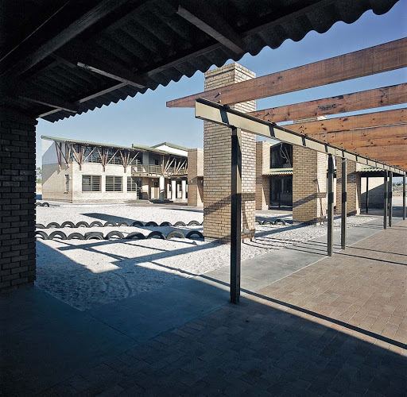
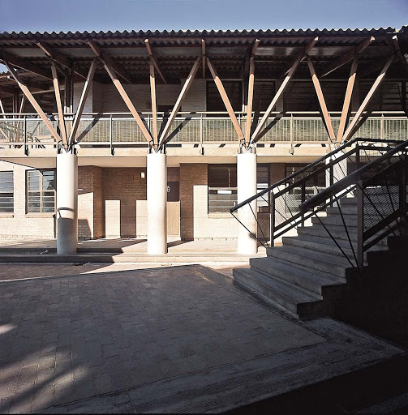

# Mzamomtsha2
$Mzamomtsha Primary School
========
​
- The project is a website for the Mzamomtsha Primary School, it helps to give information to the public about what the school stands for and what they offer to the community.
​
Usage
-----
- Slide show on homepage :
"    
(html)

    
    
    
    

​
(scripting)

"
- Contact us form :
"
(html)

    <form class="form-area">
    <h2>Contact Us</h2>
    <label for="fname">First name</label> 
    <input type="text" id="fname" placeholder="First name here" required> 
    <label for="message">Last name</label> 
    <input type="text" id="lname" placeholder="Last name here"> 
    <label for="message">Email address</label> 
    <input type="text" id="email" placeholder="Email address" required> 
    <label for="message">Your message</label> 
    <textarea id="message" rows="6" cols="30" placeholder="Enter your message here" required></textarea> 
    <input type="submit" id ="submit" value="Send Message">
    </form>

"
(scripting)

​
(html)

    <article class="box1 up">
        <h3 title="click here"><button id="button" class='click' onclick='toggle1()'>New Computers</button></h3>
        
Mzamomtsha Primary School is a school of Government. Which states that they get their funds from Government and some organizations.
        So Government provided the school with computers to help the teachers when making reports making life easy for both learners and the teachers.

    </article>

"
​
- Web page scaling
"
Usage of 
- @media screen and (min-width: 1200px){}
- @media screen and (max-width: 1200px) and (min-width: 600px) {}
- @media screen and (max-width: 600px){}
"
to scale the webpage down and for certain parts of the webpage to not display at certain widths.
​
Features
--------
​
The webpage contains :
​
- A brief description of who the principal is and the motto of the school.
- A description of the school's history and background, all the current contact details for the school, and a contact form for ease of contact. 
- A list of all past and current events happening at the school.
​
Installation
------------
 
- No installion required, you can access the website via the following link : https://alexander-fortuin.github.io/Mzamomtsha2/
​
Contribute
----------
​
- Issue Tracker: We will not have an issue tracker, please feel free to submit any issues by contacting : interncptwex025@capaciti.org.za .
​
- Source Code: github.com/Alexander-Fortuin/Mzamomtsha2
​
Support
-------
​
If you are having issues, please let us know.
​
We have a mailing list located at: interncptwex025@capaciti.org.za
​
License
-------
​
The project is licensed under the CC BY-NC-ND license.
